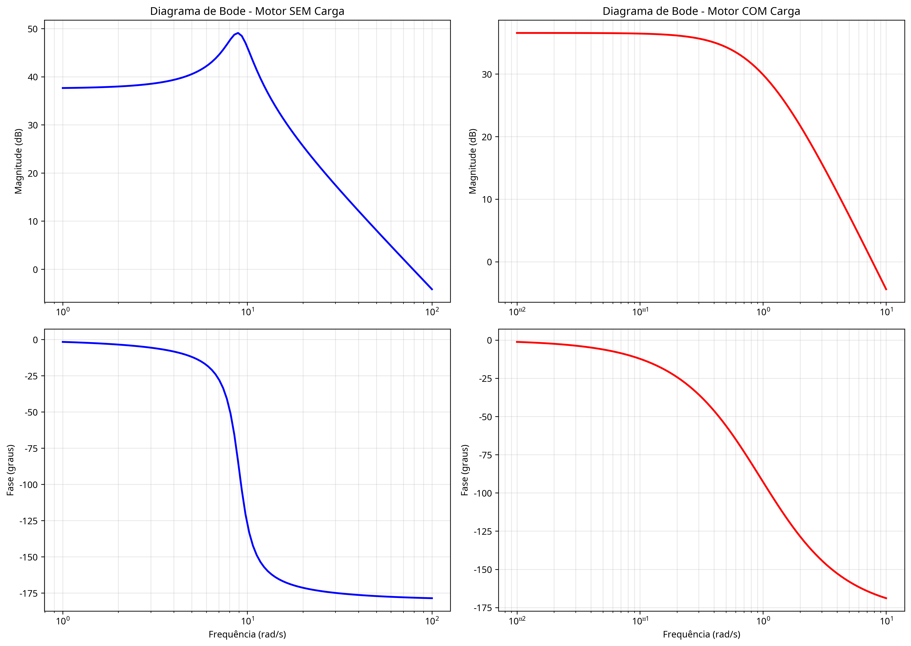

# Análise de Motor de Corrente Contínua

## Introdução

O trabalho aborda a modelagem e análise de um motor de corrente contínua (CC) com controle pela armadura, considerando seu funcionamento com e sem carga acoplada ao eixo.

Os parâmetros do motor e da carga utilizados para a análise numérica foram fornecidos no enunciado da avaliação e são listados abaixo para referência.

### Dados Utilizados

| Parâmetro | Símbolo | Valor | Unidade |
| :--- | :--- | :--- | :--- |
| Resistência de Armadura | $R_a$ | $7,75$ | $\Omega$ |
| Indutância de Armadura | $L_a$ | $4,1$ | $H$ |
| Constante de Torque | $K_t$ | $0,0131$ | $N \cdot m/A$ |
| Constante de F.C.E.M. | $K_b$ | $0,0131$ | $V \cdot s/rad$ |
| Inércia do Motor | $J$ | $5,2 \times 10^{-7}$ | $kg \cdot m^2$ |
| Atrito do Motor | $B$ | $2,7 \times 10^{-7}$ | $N \cdot m \cdot s/rad$ |
| Inércia da Carga | $J_c$ | $52 \times 10^{-6}$ | $kg \cdot m^2$ |
| Atrito da Carga | $B_c$ | $2,7 \times 10^{-6}$ | $N \cdot m \cdot s/rad$ |

## Tarefa 1: Obtenção da Função de Transferência

A primeira tarefa consiste em descrever o processo de obtenção da função de transferência $G(s) = \frac{\omega(s)}{V_a(s)}$ a partir das equações fundamentais do motor.

O modelo do motor CC é composto por uma parte elétrica, descrita pela Lei de Kirchhoff das Tensões, e uma parte mecânica, descrita pela Segunda Lei de Newton para rotação.

1.  **Equação Elétrica:** A tensão aplicada na armadura ($V_a$) se divide entre a queda de tensão no resistor ($V_{R_a}$), a queda de tensão no indutor ($V_{L_a}$) e a força contra-eletromotriz ($E_a$) gerada pelo movimento do rotor.

    $$V_a(t) = R_a I_a(t) + L_a \frac{dI_a(t)}{dt} + E_a(t)$$

2.  **Equação Mecânica:** O torque gerado pelo motor ($T_m$) é utilizado para acelerar a inércia combinada do motor e da carga ($J_m$) e para vencer o atrito viscoso combinado ($B_m$).

    $$T_m(t) = J_m \frac{d\omega(t)}{dt} + B_m \omega(t)$$

3.  **Equações de Acoplamento:** As partes elétrica e mecânica são acopladas por duas relações: o torque é proporcional à corrente de armadura e a força contra-eletromotriz é proporcional à velocidade angular.

    $$T_m(t) = K_t I_a(t)$$
    $$E_a(t) = K_b \omega(t)$$

Para obter a função de transferência, aplicamos a Transformada de Laplace às quatro equações, assumindo condições iniciais nulas:

$$V_a(s) = R_a I_a(s) + L_a s I_a(s) + E_a(s) \quad \Rightarrow \quad V_a(s) = (R_a + L_a s)I_a(s) + K_b \omega(s)$$
$$T_m(s) = J_m s \omega(s) + B_m \omega(s) \quad \Rightarrow \quad K_t I_a(s) = (J_m s + B_m)\omega(s)$$

Agora, temos um sistema de duas equações com duas incógnitas ($I_a(s)$ e $\omega(s)$). Isolamos $I_a(s)$ na segunda equação:

$$I_a(s) = \frac{(J_m s + B_m)}{K_t} \omega(s)$$

Substituímos essa expressão para $I_a(s)$ na primeira equação:

$$V_a(s) = (R_a + L_a s) \left[ \frac{(J_m s + B_m)}{K_t} \omega(s) \right] + K_b \omega(s)$$

Para simplificar, multiplicamos todos os termos por $K_t$:

$$K_t V_a(s) = (R_a + L_a s)(J_m s + B_m)\omega(s) + K_t K_b \omega(s)$$

Colocamos $\omega(s)$ em evidência no lado direito da equação:

$$K_t V_a(s) = \left[ (R_a + L_a s)(J_m s + B_m) + K_t K_b \right] \omega(s)$$

Finalmente, isolamos a razão $\frac{\omega(s)}{V_a(s)}$ para obter a função de transferência desejada:

$$G(s) = \frac{\omega(s)}{V_a(s)} = \frac{K_t}{(R_a + L_a s)(J_m s + B_m) + K_t K_b}$$

Expandindo o denominador, obtemos a forma polinomial padrão de segunda ordem:

$$(R_a + L_a s)(J_m s + B_m) + K_t K_b = R_a J_m s + R_a B_m + L_a J_m s^2 + L_a B_m s + K_t K_b$$
$$G(s) = \frac{K_t}{(L_a J_m)s^2 + (R_a J_m + L_a B_m)s + (R_a B_m + K_t K_b)}$$

## Tarefa 2: Função de Transferência (Motor sem Carga)

Nesta tarefa, calculamos a função de transferência considerando o motor operando sem carga. Isso significa que a inércia e o atrito totais são apenas os do próprio motor:

-   $J_m = J = 5,2 \times 10^{-7} \, kg \cdot m^2$
-   $B_m = B = 2,7 \times 10^{-7} \, N \cdot m \cdot s/rad$

Substituindo os valores numéricos na expressão do denominador:

-   $a = L_a J_m = (4,1) \cdot (5,2 \times 10^{-7}) = 2,132 \times 10^{-6}$
-   $b = R_a J_m + L_a B_m = (7,75) \cdot (5,2 \times 10^{-7}) + (4,1) \cdot (2,7 \times 10^{-7}) = 5,137 \times 10^{-6}$
-   $c = R_a B_m + K_t K_b = (7,75) \cdot (2,7 \times 10^{-7}) + (0,0131)^2 = 1,737 \times 10^{-4}$

A função de transferência para o motor sem carga é:

$$G_{sem\_carga}(s) = \frac{0,0131}{2,132 \times 10^{-6} s^2 + 5,137 \times 10^{-6} s + 1,737 \times 10^{-4}}$$

## Tarefa 3: Análise do Motor sem Carga

-   **Zeros:** O sistema não possui zeros finitos, pois o numerador é uma constante ($K_t$).

-   **Polos:** Os polos são as raízes do polinômio do denominador. Utilizando os coeficientes calculados, encontramos os seguintes polos:

    $$p_{1,2} = -1,205 \pm j8,946$$

-   **Modos Característicos:** Como os polos são complexos conjugados com parte real negativa, o sistema é **subamortecido** e **estável**. Os modos característicos são da forma $e^{\sigma t} \cos(\omega_d t + \phi)$, indicando uma resposta transitória oscilatória amortecida. A constante de tempo do envelope exponencial é $\tau = -1/\sigma = -1/(-1,205) \approx 0,83$ segundos.

## Tarefa 4: Função de Transferência (Motor com Carga)

Agora, consideramos o motor com a carga acoplada. A inércia e o atrito totais são a soma dos componentes do motor e da carga:

-   $J_m = J + J_c = 5,2 \times 10^{-7} + 52 \times 10^{-6} = 5,252 \times 10^{-5} \, kg \cdot m^2$
-   $B_m = B + B_c = 2,7 \times 10^{-7} + 2,7 \times 10^{-6} = 2,97 \times 10^{-6} \, N \cdot m \cdot s/rad$

Recalculando os coeficientes do denominador:

-   $a = L_a J_m = (4,1) \cdot (5,252 \times 10^{-5}) = 2,153 \times 10^{-4}$
-   $b = R_a J_m + L_a B_m = (7,75) \cdot (5,252 \times 10^{-5}) + (4,1) \cdot (2,97 \times 10^{-6}) = 4,192 \times 10^{-4}$
-   $c = R_a B_m + K_t K_b = (7,75) \cdot (2,97 \times 10^{-6}) + (0,0131)^2 = 1,946 \times 10^{-4}$

A função de transferência para o motor com carga é:

$$G_{com\_carga}(s) = \frac{0,0131}{2,153 \times 10^{-4} s^2 + 4,192 \times 10^{-4} s + 1,946 \times 10^{-4}}$$

## Tarefa 5: Análise do Motor com Carga

-   **Zeros:** Assim como no caso sem carga, o sistema não possui zeros finitos.

-   **Polos:** Calculando as raízes do novo denominador, obtemos dois polos reais distintos:

    $$p_1 = -0,764$$
    $$p_2 = -1,182$$

-   **Modos Característicos:** Como os polos são reais, distintos e negativos, o sistema é **superamortecido** e **estável**. Os modos característicos são da forma $C_1 e^{-0,764t} + C_2 e^{-1,182t}$. A resposta não apresentará oscilações. O polo dominante (mais lento) é $p_1 = -0,764$, com uma constante de tempo $\tau_1 = -1/p_1 \approx 1,31$ segundos.

## Tarefa 6: Comparação e Análise

A adição da carga ao eixo do motor provocou mudanças significativas na dinâmica do sistema.

### Comparação de Zeros e Polos

| Característica | Motor sem Carga | Motor com Carga |
| :--- | :--- | :--- |
| Zeros | Nenhum | Nenhum |
| Polos | $-1,205 \pm j8,946$ | $-0,764$, $-1,182$ |

*Figura 1: Comparação da posição dos polos no plano s. Os polos sem carga (azul, 'x') são complexos conjugados, enquanto os polos com carga (vermelho, 'o') são reais e mais próximos da origem.*

### Mudança nos Modos Característicos

Sim, **houve uma mudança fundamental nos modos característicos do sistema**. O sistema, que era **subamortecido** (oscilatório) quando operava sem carga, tornou-se **superamortecido** (não oscilatório) com a adição da carga. Isso ocorreu porque o aumento expressivo da inércia ($J_m$) e do atrito ($B_m$) alterou drasticamente os coeficientes do polinômio característico, fazendo com que o discriminante da equação de segundo grau ($Δ = b^2 - 4ac$) passasse de negativo para positivo.

### Análise da Resposta

O aumento da inércia e do atrito torna o sistema mais "lento" para responder. Isso é visualmente confirmado pela resposta ao degrau, onde o sistema com carga leva mais tempo para atingir o estado estacionário. Além disso, a mudança de um comportamento subamortecido para superamortecido significa que a resposta com carga não exibe o pico (overshoot) e as oscilações presentes na resposta sem carga.

*Figura 2: Comparação da resposta ao degrau unitário. A resposta sem carga (azul, linha sólida) é mais rápida e oscilatória, enquanto a resposta com carga (vermelho, linha tracejada) é mais lenta e suave.*

Em resumo, a carga teve o efeito de aumentar o amortecimento relativo do sistema, movendo os polos de uma posição complexa conjugada para duas posições distintas no eixo real, ambas mais próximas do eixo imaginário, resultando em uma resposta mais lenta e não oscilatória.

### Análise no Domínio da Frequência

Os diagramas de Bode complementam a análise, mostrando como a resposta em frequência do sistema é afetada pela adição da carga. O sistema sem carga apresenta um pico de ressonância na magnitude (característico de sistemas subamortecidos), enquanto o sistema com carga apresenta uma resposta mais suave, sem pico pronunciado, confirmando o comportamento superamortecido.

*Figura 3: Diagramas de Bode comparando a resposta em frequência. O sistema sem carga (esquerda) apresenta pico de ressonância, enquanto o sistema com carga (direita) tem resposta mais suave.*

## Conclusão

Este trabalho apresentou a modelagem completa de um motor de corrente contínua, desde a derivação teórica da função de transferência até a análise numérica detalhada com e sem carga acoplada. As principais conclusões são:

1. A função de transferência $G(s) = \frac{\omega(s)}{V_a(s)}$ foi derivada com sucesso a partir das equações fundamentais do motor, resultando em um sistema de segunda ordem.

2. O motor sem carga apresenta comportamento **subamortecido** (polos complexos conjugados), com resposta oscilatória e tempo de assentamento de aproximadamente 0,83 segundos.

3. O motor com carga apresenta comportamento **superamortecido** (polos reais distintos), com resposta não oscilatória e tempo de assentamento maior (aproximadamente 1,31 segundos).

4. A adição da carga causou uma **mudança qualitativa** nos modos característicos do sistema, transformando-o de subamortecido para superamortecido, o que tem implicações importantes para o projeto de controladores.

5. Ambos os sistemas são **estáveis**, pois todos os polos possuem parte real negativa.

## Apêndice A: Resultados Numéricos Resumidos

### Motor sem Carga

**Função de Transferência:**
$$G(s) = \frac{0,0131}{2,132 \times 10^{-6} s^2 + 5,137 \times 10^{-6} s + 1,737 \times 10^{-4}}$$

**Polos:**
- $p_1 = -1,205 + j8,946$
- $p_2 = -1,205 - j8,946$

**Parâmetros de Segunda Ordem:**
- Frequência natural: $\omega_n \approx 9,02 \, rad/s$
- Coeficiente de amortecimento: $\zeta \approx 0,134$
- Constante de tempo: $\tau \approx 0,83 \, s$

### Motor com Carga

**Função de Transferência:**
$$G(s) = \frac{0,0131}{2,153 \times 10^{-4} s^2 + 4,192 \times 10^{-4} s + 1,946 \times 10^{-4}}$$

**Polos:**
- $p_1 = -0,764$
- $p_2 = -1,182$

**Constantes de Tempo:**
- $\tau_1 = 1,31 \, s$ (modo dominante)
- $\tau_2 = 0,85 \, s$ (modo rápido)

